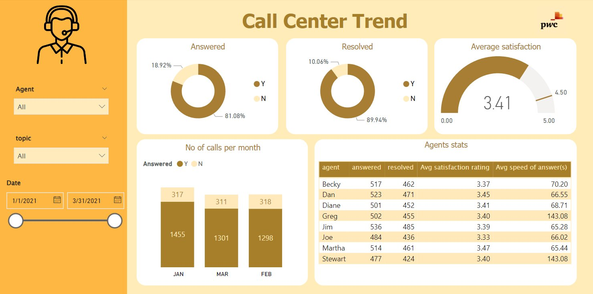
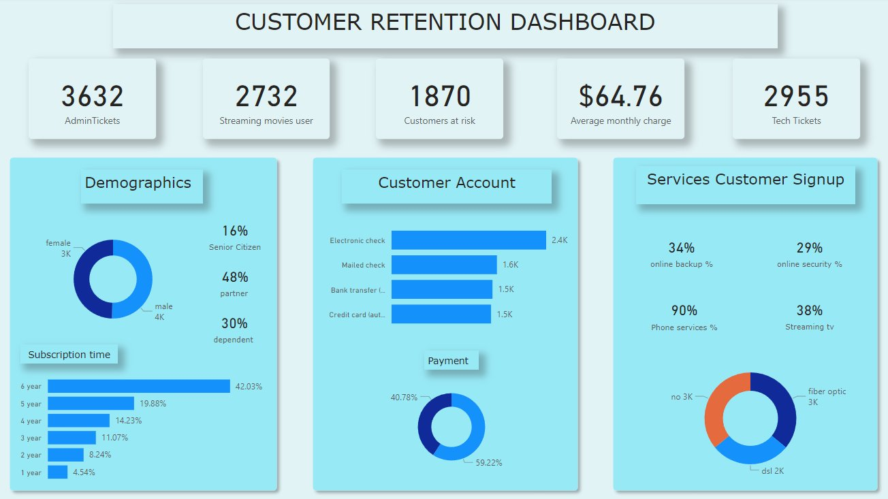
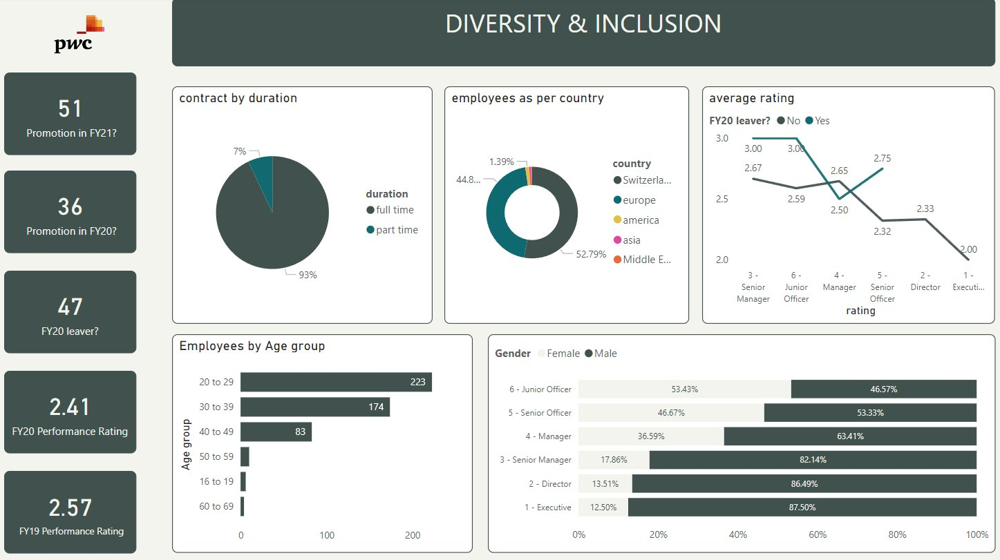

# 📊 PwC Switzerland – Power BI Job Simulation (Forage)


> Virtual internship completed via **Forage** | Certificate issued **November 9th, 2024**

## 🌐 Live Portfolio Website
👉 **[View Live Site](https://manish1422n.github.io/pwc-powerbi-project)**

---

## 🗂️ Project Overview

This repository contains all three tasks completed as part of the **PwC Switzerland Power BI Job Simulation** on Forage. The simulation covered real-world business scenarios requiring data cleaning, dashboard creation, DAX calculations, and deriving actionable business insights.

| Task | Topic | Tools Used |
|------|-------|-----------|
| Task 1 | Call Centre Trend Analysis | Power BI, MySQL |
| Task 2 | Customer Retention & Churn | Power BI, DAX |
| Task 3 | Diversity & Inclusion | Power BI, Excel |

---

## 📁 Repository Structure

```
pwc-powerbi-project/
│
├── images/
│   ├── task1_call_center.png         # Call Centre dashboard screenshot
│   ├── task2_customer_retention.png  # Churn dashboard screenshot
│   └── task3_diversity_inclusion.png # Diversity & Inclusion dashboard screenshot
│
├── sql/
│   └── call_center_analysis.sql      # MySQL queries for Task 1
│
├── index.html                        # Interactive portfolio page
└── README.md
```

---

## 📌 Task 1 – Call Centre Trend Analysis

### Objective
Analyse call centre performance data and build an interactive Power BI dashboard to track KPIs for the manager.

### Dashboard Preview


### Key Insights
- **81.08%** of total calls were answered; **18.92%** were abandoned
- **89.94%** of answered calls were successfully resolved — a strong performance indicator
- **Average customer satisfaction rating: 3.41 / 5.00**
- January had the highest call volume (1,455 answered calls)
- Agent **Jim** handled the most resolved calls (485), while **Greg** and **Stewart** had the slowest avg speed of answer (143 seconds)
- DAX measures used for KPI cards and dynamic filtering by Agent, Topic, and Date range

### SQL Analysis
MySQL queries were written alongside Power BI for validation:
- Resolved call count by topic
- Average talk duration by topic
- Average satisfaction rating per topic
- Average speed of answer
- Monthly answered call totals
- Per-agent performance summary (answered, resolved, avg rating, avg speed)

📄 See [`sql/call_center_analysis.sql`](sql/call_center_analysis.sql)

---

## 📌 Task 2 – Customer Retention & Churn Dashboard

### Objective
Build a retention dashboard to identify customers at risk of churning before they leave, helping the Retention Manager take proactive action.

### Dashboard Preview


### Key Insights
- **1,870 customers identified as at risk** out of 7,043 total customers
- **3,632 Admin Tickets** and **2,955 Tech Tickets** raised — high support load
- **Average monthly charge: $64.76**
- **2,732 customers** subscribed to streaming movies
- Customers on **6-year contracts** account for 42.03% of the base — high loyalty segment
- **Electronic check** is the most common payment method (2.4K customers)
- **90% of customers** use phone services; only **38%** use streaming TV
- Fiber optic and DSL internet roughly split the base (3K each)
- DAX used to calculate churn rate, at-risk segmentation, and demographic breakdowns

---

## 📌 Task 3 – Diversity & Inclusion Analysis

### Objective
Help HR analyse gender balance and diversity metrics across job levels at a telecom client, and identify areas for improvement.

### Dashboard Preview


### Key Insights
- **51 promotions in FY21**, **36 in FY20** — upward trend in promotions
- **47 FY20 leavers** tracked for exit analysis
- **93% of employees on full-time contracts**, 7% part-time
- **Switzerland (52.79%)** and **Europe (44.8%)** make up the vast majority of workforce
- Largest age group: **20–29 years (223 employees)**
- Gender gap widens at senior levels:
  - Junior Officer: nearly balanced (53% F / 47% M)
  - Director: 13.51% F / 86.49% M
  - Executive: **12.50% F / 87.50% M** — significant gap at top
- FY20 performance rating: **2.41** | FY19: **2.57** — slight decline year-over-year

---

## 🛠️ Tools & Technologies

| Tool | Usage |
|------|-------|
| **Power BI Desktop** | Dashboard creation, DAX, data modeling |
| **DAX** | KPI measures, calculated columns, dynamic visuals |
| **MySQL** | Data validation and SQL-based analysis |
| **Microsoft Excel** | Data cleaning and pre-processing |

---

## 📜 Certificate

**PwC Switzerland Power BI Job Simulation** – Forage
Completed by **Manish Mittal** | Issued: **November 9, 2024**

Tasks covered: Introduction · Call Centre Trends · Customer Retention · Diversity & Inclusion

---

## 👤 About Me

**Manish Mittal** – Data Analyst
- 🔗 LinkedIn: [linkedin.com/in/manish-mittal-data-analyst](https://linkedin.com/in/manish-mittal-data-analyst)
- 💻 GitHub: [github.com/manish1422n](https://github.com/manish1422n)
- 📧 22manishmittal@gmail.com

---

*This project was completed as part of the PwC Switzerland virtual experience programme hosted on Forage.*
